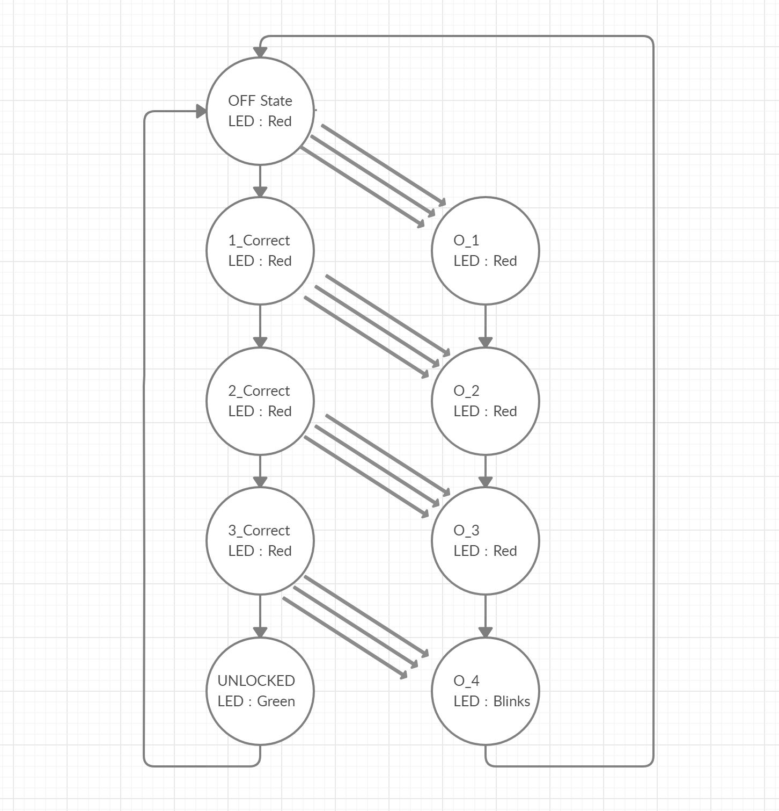

# mips-door-lock
•	A simple electronic door lock implementation that shows the door is locked by lighting an RBG LED red. The user is provided 5 buttons: 4 for input combination and 1 for resetting the lock back to the locked state.

•	The user uses a specific 4-key combination using the 4 buttons to traverse through the different states of the design to finally reach the unlocked state.

•	This unlocked state is displayed by the red LED switching to a green color, indicating an unlocked door.

•	Entering the combination of 4 key presses wrong flickers the red LED and the lock goes back to the reset state.

State Diagram:

User Input: 
•	5 x Buttons: 4 for combination entry, 1 for resetting lock

User Output: 
•	RGB LED: Red for Locked, Green for Unlocked

Required Hardware:
•	PICDEM LAB II Prototype board
•	RGB LED
•	3 x 220 Ohm resistors
•	5 x 10k Ohm resistors
•	5 x buttons
